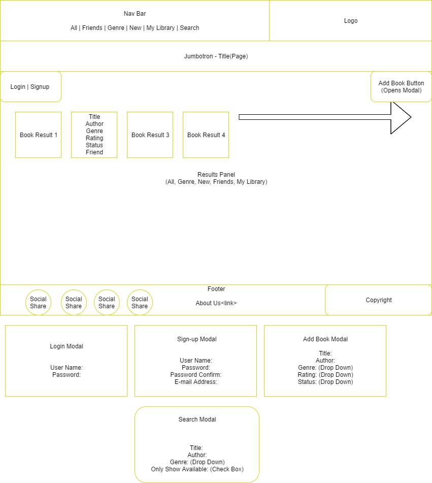
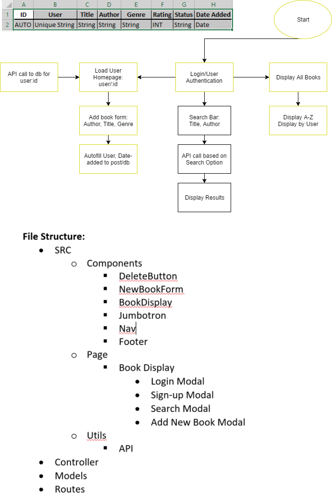

# Friend Library

Mini-sharing economy site allowing friends to upload book titles they are willing to share with friends within their network.

# Wireframe

## FlowChart

## Screenshots

??Place Holder??

## How to Use
<ul>

<li>When the app loads, log-in and then all of the available books in the Friend Library will load</li>

<li>You can search by Title, Author or Genre</li>

<li>Or if you're a frequent user, you can click the "New" tab in the navigation bar to see the latest books added to the library.</li>

<li>You can also add your own books to the library by clicking the "add new book" button  in the top left-hand corner under the navigation bar and completing the form</li>

<li>Once you've found a book that you'd like to barrow, simply contact your friend and arrange a coffee date to swap books...</li>
<li>... it's that simple!</li>
</ul>

## How to Contribute

We're currently looking for help developing the following features to improve the Friend Library application and the user experience: 

<ul>
<li> Authenticated User-login. </li>
<li>Using Authenticated login automatically add user to "user" field in the New Book Modal.</li>
<li>Add API search capability on title search to confirm title and auto-import ISBN, author, title, and other relevant information.</li>
<li>Add OCR to allow users to take a photo of the ISBN # or UPC # to add titles to their collection.</li>
<li>Allow users to update and remove books in their collection. </li>
</ul>

To Contribute, please reach me on my GitHub accounts below

## Author

[Jordan Gary](https://github.com/JigSays)

# Technologies Used
<ul>
<li> HTML5 </li>
<li>React</li>
<li>BootStrap</li>
<li>CSS3</li>
<li>Axios </li>
<li>Express.js</li>
</ul>

# Special Thanks

[Heroku](https://loo-locator.herokuapp.com/) 
[GitHub](https://github.com/JigSays/Loo-Locator) 
